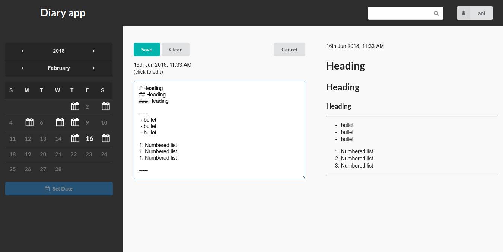

# Diary app

A password protected offline diary for storing personal entries with a calendar view for filtering entries. The app allows users to login with their google accounts.

## Demo
[diary app]()

## Contents
- [Prerequisites](#prerequisites)
- [Installation](#installation)
- [Features](#features)
- [Screenshots](#screenshots)
    - [Landing page](#landing-page)
    - [Calendar view](#calendar-view)
    - [Editor](#editor)
    - [Settings](#settings)
- [Usage](#usage)
- [License](#license)

## Prerequisites
* [npm](https://www.npmjs.com/get-npm)

## Installation
Clone the app repository and install necessary packages.

```
$ git clone https://github.com/anigopale/diary-app.git
$ cd diary-app
$ npm install
```

## Features
* password protected
* allows Google login
* markdown support
* simple live search
* calendar for filtering entries
* stores encrypted entries in browser based Database(IndexedDB)
* calendar export (.ics format)

## Screenshots

### Landing page


### Calendar view


### Editor


### Settings


## Usage
Run the start script and navigate to ``localhost:3000`` in your browser.
```
$ npm run start
```

## License
[MIT](LICENSE)
